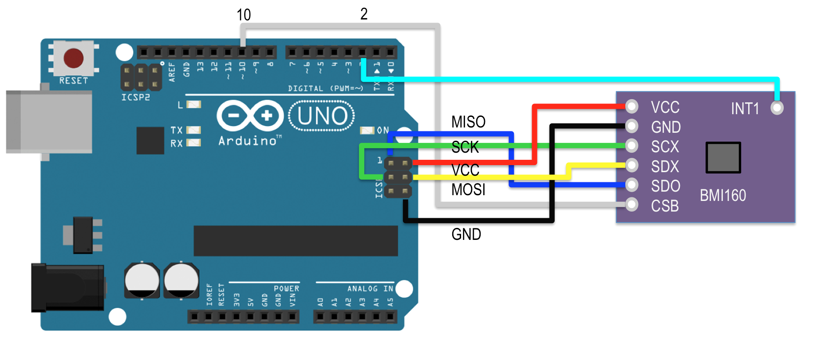
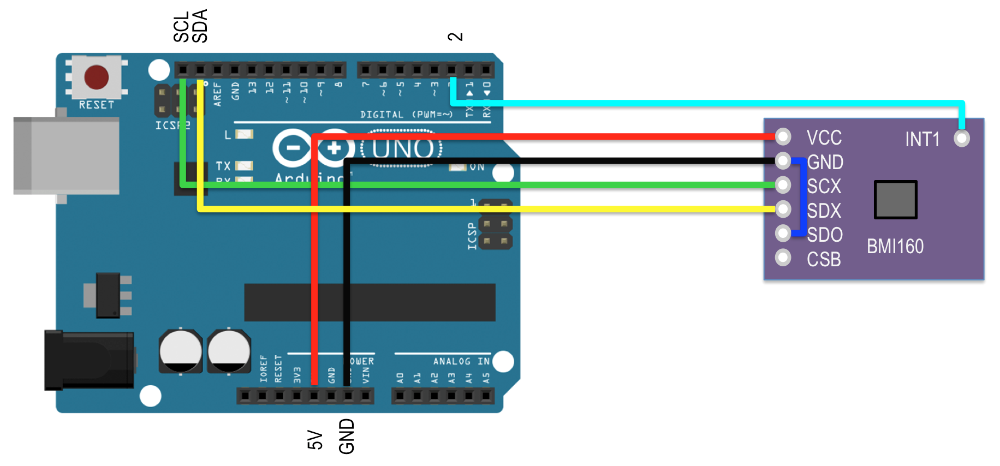

This is a fork of https://github.com/hanyazou/BMI160-Arduino in the effort to make it compatible with ESP32 on PlatformIO. For me it's working with no issues so far. To install this library into your project, add `https://github.com/bastian2001/BMI160-Arduino-1` into your `platform.ini`'s  `lib_deps`.

If you have any issues, don't hesitate to ask, but please don't expect me to fix things. This is first and foremost just for me and people where hanyazou's library doesn't work and this "just works".

# BMI160-Arduino

This driver is for BMI160 6DoF sensor breakout boards which are connected through the Arduino SPI.
Derived from the Intel's CurieIMU driver for the Arduino/Genuino 101.

Intel's driver repository: https://github.com/01org/corelibs-arduino101/tree/master/libraries/CurieIMU

BMI160: https://www.bosch-sensortec.com/bst/products/all_products/bmi160

## How to install
Copy all files of this project to the your Arduino IDE library folder.

Example:
```
cp ~/github/BMI160-Arduino ~/Documents/Arduino/libraries/
```

## Get sensor board
You can find cheap breakout boards ($2~3 USD) on the eBay.
Pin names may vary by board vendors. I have two variations of BMI160 breakout board.


## Wiring

### SPI mode
You should connect some digital out pin to the CSB of the BMI160 and tell the number of the pin to the initialize method, begin().


### I2C mode
You should connect SDO/SA0 pin of the BMI160 to GND for default I2C address or tell the I2C address to the initialize method, begin().


## Code
```
#include <BMI160Gen.h>

const int select_pin = 10;
const int i2c_addr = 0x68;

void setup() {
  Serial.begin(9600); // initialize Serial communication
  while (!Serial);    // wait for the serial port to open

  // initialize device
  BMI160.begin(BMI160GenClass::SPI_MODE, select_pin);
  //BMI160.begin(BMI160GenClass::I2C_MODE, i2c_addr);
}

void loop() {
  int gx, gy, gz;         // raw gyro values

  // read raw gyro measurements from device
  BMI160.readGyro(gx, gy, gz);

  // display tab-separated gyro x/y/z values
  Serial.print("g:\t");
  Serial.print(gx);
  Serial.print("\t");
  Serial.print(gy);
  Serial.print("\t");
  Serial.print(gz);
  Serial.println();

  delay(500);
}
```

## Compatibility

Board           |MCU         |tested works|doesn't work|not tested| Notes
----------------|------------|------------|------------|----------|-----
Arduino UNO     |ATmega328P  | X          |            |          |
Arduino 101     |Intel Curie | X          |            |          |
Arduino Leonardo|ATmega32u4  | X          |            |          | D7 pin for INT
Arduino M0 PRO  |ATSAMD21G   | X          |            |          | D7 pin for INT

Other boards which have the same MCU might be work well.
